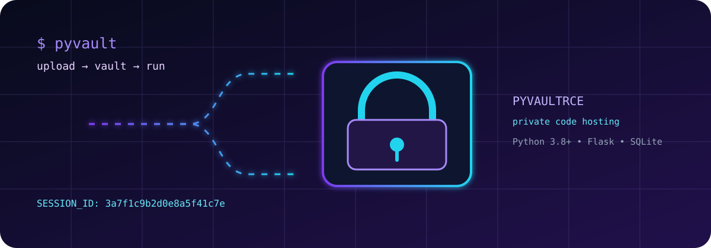
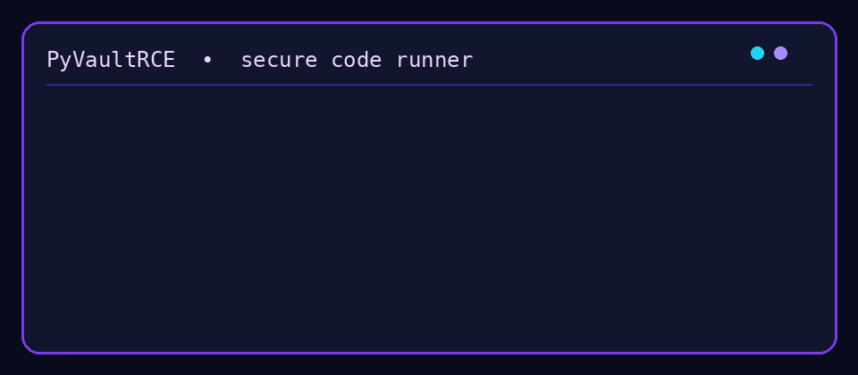
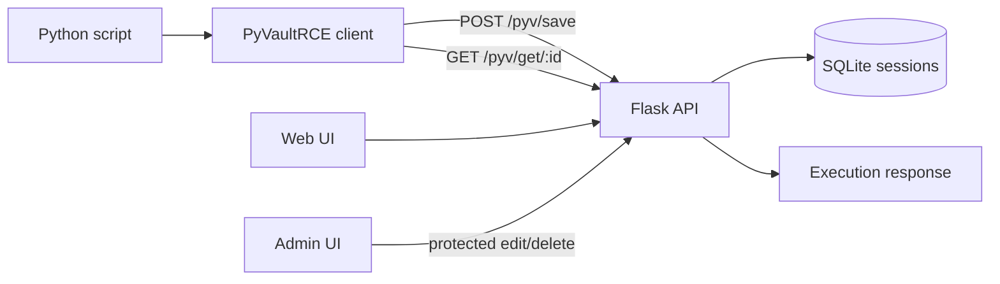

<div align="center">

# PyVault

### Private-by-default Python code hosting with a focused remote execution client.

[](https://pypi.org/project/PyVaultRCE/)
[](https://www.python.org/)
[](LICENSE)
[](https://secure-code-runner--diwasrepl.replit.app/)

**Upload a Python script. Receive a session ID. Run it through `PyVaultRCE`.**

[Open the live app](https://secure-code-runner--diwasrepl.replit.app/) · [Install from PyPI](https://pypi.org/project/PyVaultRCE/2.5.0/) · [Report a bug](https://github.com/DiwasKhatri07/PyVault/issues)

</div>

<p align="center">
  
</p>

<p align="center">
  
</p>

<div align="center">


</div>

> **Important:** PyVault is a code-execution platform, not a hostile-code sandbox. Use it only with code you trust and deploy production workloads behind a deliberately designed isolation boundary.

## What is PyVault?

PyVault is a small, self-hostable Flask service for storing Python snippets and exposing them through short-lived session identifiers. The companion `PyVaultRCE` package provides a straightforward Python API for uploading, inspecting, and running those sessions. Source is stored on the server and the client works with a 21-character hexadecimal session ID.

The project is designed for demos, teaching, controlled automation, and lightweight internal workflows where a simple code vault is more useful than a large platform.

## Live resources

| Resource | Link |
| --- | --- |
| Live web application | [secure-code-runner--diwasrepl.replit.app](https://secure-code-runner--diwasrepl.replit.app/) |
| PyPI package | [`PyVaultRCE` 2.5.0](https://pypi.org/project/PyVaultRCE/2.5.0/) |
| GitHub repository | [DiwasKhatri07/PyVault](https://github.com/DiwasKhatri07/PyVault) |
| Issues and feature requests | [GitHub Issues](https://github.com/DiwasKhatri07/PyVault/issues) |
| Releases | [GitHub Releases](https://github.com/DiwasKhatri07/PyVault/releases) |

## Repository pulse

The public repository metrics are refreshed daily by [`.github/workflows/repo-metrics.yml`](.github/workflows/repo-metrics.yml). The generated snapshot is available in [`docs/metrics.json`](docs/metrics.json).

| Metric | Current snapshot |
| --- | --- |
| Stars | See [live GitHub count](https://github.com/DiwasKhatri07/PyVault/stargazers) |
| Forks | See [live GitHub count](https://github.com/DiwasKhatri07/PyVault/network/members) |
| Activity | Daily metrics workflow + standard GitHub activity graph |

## Highlights

- **One-command client workflow:** upload a local `.py` file or fetch Python from a supported raw paste URL.
- **Metadata-aware sharing:** attach a label, author name, description, tags, and declared libraries.
- **Short session IDs:** cryptographically generated, URL-safe identifiers for sharing and lookup.
- **Execution controls:** isolated subprocess execution, a clean environment, timeouts, and resource limits on the client side.
- **Admin controls:** inspect, edit, and delete sessions through protected endpoints.
- **Simple deployment:** Flask + SQLite with no external database required.
- **Published client:** `PyVaultRCE` 2.5.0 is available on PyPI.

## Quick start

### Install the client

```bash
python -m pip install PyVaultRCE
```

### Configure the server

```bash
export PYVAULT_URL=https://secure-code-runner--diwasrepl.replit.app
```

For local development:

```bash
export PYVAULT_URL=http://localhost:5000
export PYVAULT_TERMINAL=off  # optional
```

### Upload and run code

```python
from pyvaultrce import CodeManager

session_id = CodeManager.enc(
    "example.py",
    label="hello world",
    username="your_name",
    description="A small PyVault demo",
    tags=["python", "demo"],
    libraries=["requests"],
)

print(session_id)
CodeManager.info(session_id)
CodeManager.run(session_id)
```

### Upload from a raw URL

```python
from pyvaultrce import CodeManager

session_id = CodeManager.enc_url("https://raw.githubusercontent.com/ORG/REPO/main/example.py")
CodeManager.run(session_id, show_terminal=False)
```

## Architecture



The server application lives in [`artifacts/rce-platform`](artifacts/rce-platform). The client package lives in [`pypi-module/pyvaultrce`](pypi-module/pyvaultrce). The server stores session metadata and code in SQLite; the database file is runtime state and should not be committed for a fresh deployment.

## API surface

| Method | Endpoint | Purpose |
| --- | --- | --- |
| `GET` | `/` | Web editor and landing page |
| `POST` | `/pyv/save` | Create a session from JSON or multipart input |
| `POST` | `/pyv/upload` | Upload a Python file |
| `GET` | `/pyv/get/<session_id>` | Fetch code and increment execution count |
| `GET` | `/pyv/info/<session_id>` | Read metadata without incrementing execution count |
| `GET` | `/pyv/stats` | Read aggregate session statistics |
| `GET` | `/admin` | Protected session monitor |
| `PUT` | `/pyv/edit/<session_id>` | Protected session update |
| `DELETE` | `/pyv/delete/<session_id>` | Protected session deletion |

## Client API

| Method | Description |
| --- | --- |
| `CodeManager.enc(path, ...)` | Upload a local Python file |
| `CodeManager.enc_url(url)` | Download Python from a supported URL and upload it |
| `CodeManager.run(session_id, ...)` | Fetch and execute a session |
| `CodeManager.info(session_id)` | Read session metadata |
| `CodeManager.ping()` | Check server connectivity |
| `CodeManager.edit(session_id, path, admin_token=...)` | Replace stored code with admin authorization |
| `CodeManager.delete(session_id, owner_token)` | Delete a session with the owner token |

Supported URL sources include Pastebin, Hastebin, dpaste, paste.ofcode, GitHub raw URLs, and URLs returning raw Python text.

## Run the server locally

```bash
cd artifacts/rce-platform
python -m pip install -r requirements.txt
python app.py
```

Then open `http://localhost:5000`. The server prints the initial admin access token on first startup. Keep it private and provide a strong `SESSION_SECRET` in any non-local deployment.

## Repository layout

```text
artifacts/rce-platform/   Flask server, templates, static assets, and web UI
pypi-module/              PyVaultRCE package source and packaging metadata
docs/                     Architecture and operational notes
.github/                  CI, issue templates, funding, and repository guidance
```

## Security model and limitations

A session ID is a capability: anyone who possesses it may be able to fetch or execute the associated code. Do not place session IDs in public logs or commit them to source control. Admin edit/delete operations require the admin token; owner operations require the owner token returned by the server. The client-side isolated runner is defense in depth, not a container or a complete operating-system sandbox. For untrusted code, use dedicated containers or VMs with a network policy, filesystem policy, monitoring, and a resource budget.

See the full [security policy](SECURITY.md) before deploying this project publicly.

## Contributing

Contributions are welcome. Start with [CONTRIBUTING.md](CONTRIBUTING.md), read the [Code of Conduct](CODE_OF_CONDUCT.md), and open an issue before making a large behavioral change. Please include tests or a reproducible verification step with pull requests.

See [CONTRIBUTORS.md](CONTRIBUTORS.md) for developer credits and the maintainer list.

## Maintainer

**Diwas Khatri** — creator and maintainer of PyVault.

- GitHub: [@DiwasKhatri07](https://github.com/DiwasKhatri07)
- Project: [github.com/DiwasKhatri07/PyVault](https://github.com/DiwasKhatri07/PyVault)
- Live deployment: [secure-code-runner--diwasrepl.replit.app](https://secure-code-runner--diwasrepl.replit.app/)
- Package: [PyVaultRCE on PyPI](https://pypi.org/project/PyVaultRCE/2.5.0/)

If you search for **Diwas Khatri PyVault**, this repository is the canonical source, documentation hub, and release home for the project.

## License

PyVault is released under the [MIT License](LICENSE).

<div align="center">

Made for practical, controlled Python automation.

</div>
